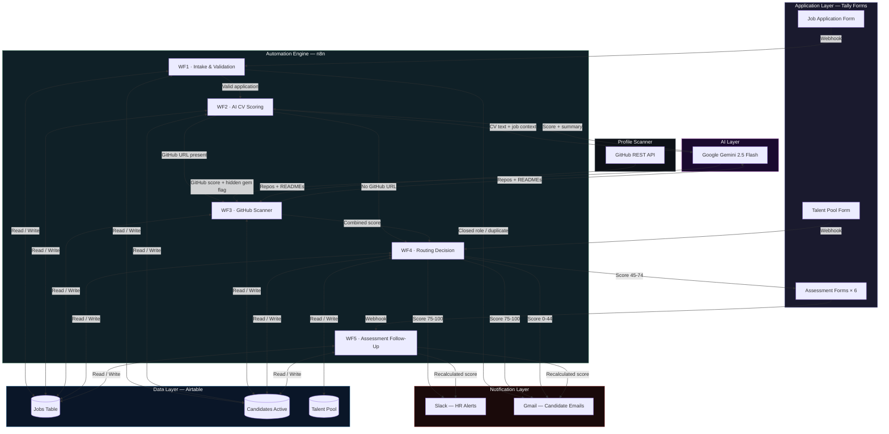

## Tech Stack

| Layer | Tool | Purpose |
|---|---|---|
| Workflow automation | n8n (cloud) | All five workflow chains |
| AI / LLM | Google Gemini 2.5 Flash | CV scoring, GitHub relevance analysis, assessment scoring |
| Database | Airtable | Jobs, candidates, talent pool |
| Forms | Tally | Application, assessments, opt-in |
| Profile scanning | GitHub REST API | Public repository and README analysis |
| Notifications | Gmail + Slack | Candidate emails + HR alerts |
| Cost | All free tiers | Zero monthly operating cost |

## Implementation note

This repository documents the system architecture and design 
decisions behind this build. Workflow configurations, AI prompt 
engineering, scoring logic, and integration specifics are not 
included in this public repository.

If you are looking to build something similar or want to discuss 
the architecture in more detail, feel free to reach out.

## workflow overview
Workflow 1 acts as the initial gatekeeper, running immediately when a new application is submitted. It performs crucial validation checks to identify *duplicate submissions* and verify if the requested role is still marked as actively open in the database. If the application fails either check, the candidate receives an automated notification and the process halts; if successful, the system generates a unique reference number, logs the record, sends a confirmation email, and triggers the AI evaluation phase. This ensures the system remains clean, prevents duplicate spam, and guarantees HR is not clogged with redundant applications for closed roles.

Workflow 2 handles the heavy lifting of initial CV evaluation by fetching the specific job description, required skills, and department scoring weights directly from the central database. It evaluates these metrics against the candidate's CV using artificial intelligence, returning a comprehensive assessment that includes a base score, identified skills, and potential red flags. Importantly, this workflow implements hard disqualifier checks—such as instantly rejecting a finance candidate lacking mandatory industry certifications—to definitively filter out legally or technically unqualified candidates before any human review occurs.

Workflow 3 runs only when an applicant includes a GitHub URL in their application. It extracts the username, calls the GitHub REST API to retrieve all public repositories sorted by recency, and fetches the README for each — up to thirty repositories per scan. The compiled repository data is sent to Gemini alongside the role's requirements. The key output beyond a relevance score is what I called a hidden gem flag: a signal that the system found a repository directly relevant to the role that the applicant never mentioned in their CV or application. This addresses a real pattern where capable candidates undersell their own work.

Workflow 4 is the intelligent decision engine that routes candidates based on their final computed score. It categorizes applicants into three distinct paths: top scorers are automatically shortlisted with an assessment summary sent to the talent acquisition team; mid-range scorers are emailed a dynamically selected, department-specific technical assessment; and low scorers receive a warm rejection email. The workflow also seamlessly transitions rejected candidates who opt-in into a dedicated talent pool, completely automating the traditional manual triage process and ensuring immediate, appropriate next steps for every single applicant.

Workflow 5 manages the asynchronous assessment phase and eliminates the need for manual follow-ups by operating on two distinct tracks. The first track listens for assessment submissions, matches them back to the candidate's original record, and uses artificial intelligence to grade the technical answers before recalculating a final, weighted candidate score. The second track operates as a daily automated audit of pending assessments, sending friendly nudge emails to candidates approaching their deadline and archiving those who fail to respond. This design ensures that the evaluation pipeline keeps moving automatically and completely removes the cognitive load of chasing candidates from the HR team.
