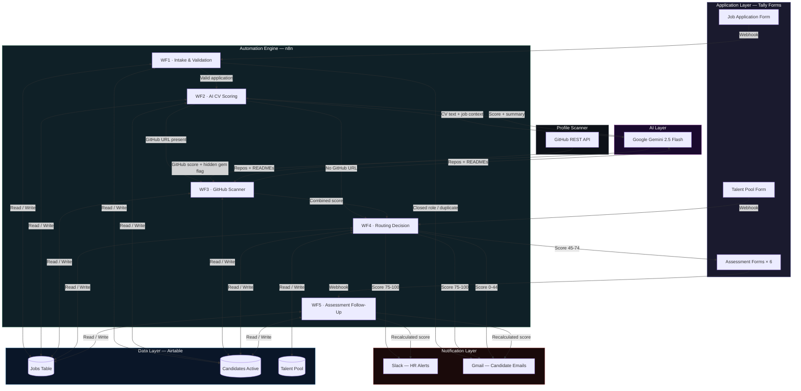

## Tech Stack

| Layer | Tool | Purpose |
|---|---|---|
| Workflow automation | n8n (cloud) | All five workflow chains |
| AI / LLM | Google Gemini 2.5 Flash | CV scoring, GitHub relevance analysis, assessment scoring |
| Database | Airtable | Jobs, candidates, talent pool |
| Forms | Tally | Application, assessments, opt-in |
| Profile scanning | GitHub REST API | Public repository and README analysis |
| Notifications | Gmail + Slack | Candidate emails + HR alerts |
| Cost | All free tiers | Zero monthly operating cost |

## Implementation Note

This repository documents the system architecture and design 
decisions behind this build. Workflow configurations, AI prompt 
engineering, scoring logic, and integration specifics are not 
included in this public repository.

If you are looking to build something similar or want to discuss 
the architecture in more detail, feel free to reach out.

## Workflow Overview
| Workflow | Workflow Description |
|---|---|
| 1. Application Submission | The first step is about keeping the database clean. When an application comes in, the system immediately checks if it is a duplicate or if the role is still open. If either fails, it stops right there and emails the candidate. Otherwise, it logs the applicant, generates a reference ID, and kicks off the evaluation. This saves HR from digging through hundreds of dead-end applications. |
| 2. AI Scoring | This is where the actual filtering happens. The system pulls the job description and scoring weights, then runs the candidate's CV against them. It returns a base score and flags any missing skills. The most important part here is the hard disqualifiers. If someone applies for a senior finance role without an ICAN certification, they are instantly rejected. It keeps unqualified candidates out of the pipeline completely. |
| 3. GitHub Scanner | Workflow 3 runs only when an applicant includes a GitHub URL in their application. It extracts the username, calls the GitHub REST API to retrieve all public repositories sorted by recency, and fetches the README for each, *(up to thirty repositories per scan)*. The compiled repository data is sent to Gemini alongside the role's requirements. The key output beyond a relevance score is what I called a ***hidden gem flag***: a signal that the system found a repository directly relevant to the role that the applicant never mentioned in their CV or application. This addresses a real pattern where capable candidates undersell their own work. |
| 4. Routing | Once we have a final score, this workflow decides what to do next. Anyone scoring over **75** gets shortlisted, and the talent team is notified on Slack. Mid-range scores (45 to 74) trigger an email with a department-specific technical test. Under 45 is an automatic rejection. A webhook is also included so rejected candidates can opt into a talent pool. It automates the triage phase. |
| 5. Assessment Follow-Up | Following up with people is usually the worst part of HR, <ins>so this handles it asynchronously</ins>. One track listens for completed assessments, grades them, and recalculates the applicant's final score. The second track runs every morning at 8 AM. It checks who hasn't submitted their test, nudges them on day five, and archives them by day eight. Nobody falls through the cracks, and HR doesn't have to remember to chase anyone down. |
