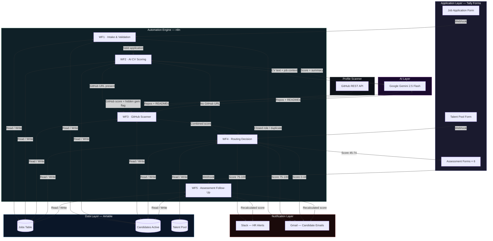

## Tech Stack

| Layer | Tool | Purpose |
|---|---|---|
| Workflow automation | n8n (cloud) | All five workflow chains |
| AI / LLM | Google Gemini 2.5 Flash | CV scoring, GitHub relevance analysis, assessment scoring |
| Database | Airtable | Jobs, candidates, talent pool |
| Forms | Tally | Application, assessments, opt-in |
| Profile scanning | GitHub REST API | Public repository and README analysis |
| Notifications | Gmail + Slack | Candidate emails + HR alerts |
| Cost | All free tiers | Zero monthly operating cost |

## Implementation note

This repository documents the system architecture and design 
decisions behind this build. Workflow configurations, AI prompt 
engineering, scoring logic, and integration specifics are not 
included in this public repository.

If you are looking to build something similar or want to discuss 
the architecture in more detail, feel free to reach out.
